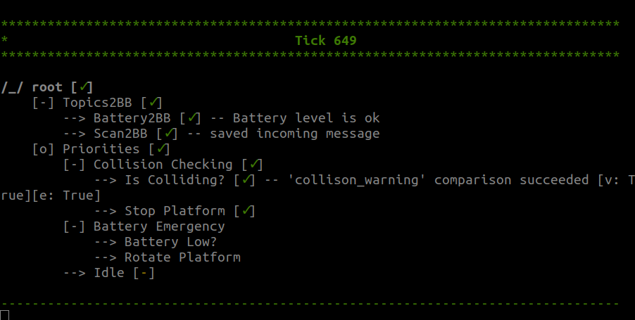
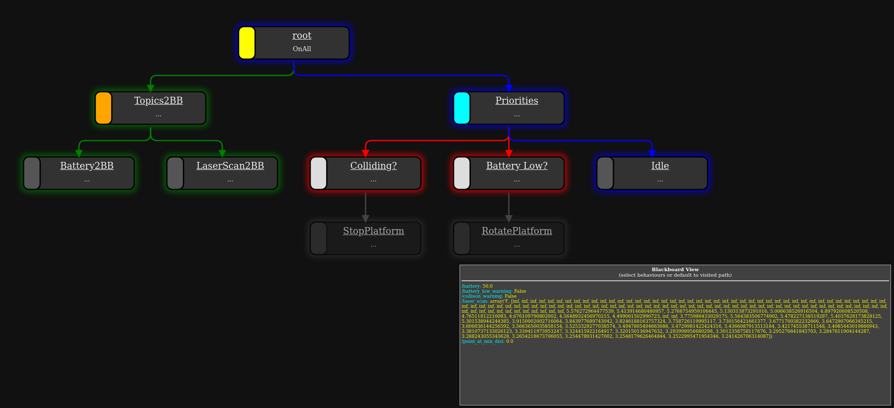

# WS23_AST_Assignment_BehaviorTree_StateMachine

## Overview

In this assignment, we will explore the implementation of behavior trees and state machines to establish primary safety features for a robot; this includes situations like the battery level falling below a certain threshold and avoiding potential collisions.

State machines are used to co-ordinate between different tasks in robots, which allows to describe the task and the transition conditions. SMACH is one of the frameworks which facilitates creating and managing state machines. SMACH is ROS independent, and `executive_smach` provides integration with ROS. We will be using `executive_smach` to implement a state machine.

Behavior trees are used to define hierarchical structures of behaviors, which are designed to be adaptable and modular. The design considerations allow for defining transitions between behaviors. The majority of implementations of behavior trees in robotics are using `BehaviorTree.CPP` in cpp and `py_trees` in python. `py_trees_ros` is a wrapper for `py_trees` to integrate it with ROS. We will be using `py_trees_ros` to implement behavior trees. 

## Description of the files

1. **safety_monitoring_SMACH.py**: is a state machine implementation which defines states and the transition conditions between them

2. **behaviors.py**: all behaviors that will be used in your behavior tree should be implemented in this script

3. **safety_monitoring_BT.py**: is a behavior tree composition implementation which composes different behaviors and decides on the transitions between behaviors. 
The following is a sample visualisation when the robot is about to collide:



For getting a better intuition of behavior trees, another sample visualisation of a similar task, but with a slightly different structure can be found below:



## Task

* Complete the code **safety_monitoring_BT.py**, **behaviors.py**, and **safety_monitoring_SMACH.py** according to the instructions given in the scripts.
* Integrate these implemented components into a ROS2 python package, with two launch files to run both implementations independently.

Note that The [SMACH tutorials](https://wiki.ros.org/smach/Tutorials), [py_trees documentation](https://py-trees.readthedocs.io/en/devel/), and [py_trees_ros tutorials](https://py-trees-ros-tutorials.readthedocs.io/en/release-2.1.x/tutorials.html) will be helpful for your implementation

## Setting up your system

1. Please setup Ubuntu 22.04, ROS2 humble, and the Robile simulation if not already done using the [documentation](https://robile-amr.readthedocs.io/en/humble/)

2. Clone the `executive_smach` repository in the src folder of your workspace, and also install the `py-trees-ros` packages:
    ```
    cd ~/ros2_ws/src/  
    git clone -b ros2 https://github.com/ros/executive_smach.git  
    sudo apt-get install ros-humble-py-trees ros-humble-py-trees-ros ros-humble-py-trees-ros-interfaces xcb
    ```

    From the workspace directory, build the workspace:
    ```
    cd ~/ros2_ws/
    colcon build --symlink-install
    ```

    Now source the workspace setup file:
    ```
    source install/setup.bash
    ```
3. Create a new ROS2 python package and integrate the provided scripts in it


## Tips while running the scripts

1. Steps:
    - Run the Robile in simulation
    - Create and launch, for example, `safety_monitoring_BT.launch.py` or `safety_monitoring_SMACH.launch.py` and verify the desired behavior
    - In your submission, include screenshots to verify that your behaviour is running.
2. As the battery percentage is not readily available in simulation, please publish the battery percentage values manually. Considering the topic being subscribed is `/battery_voltage`, publish a battery percentage value of your choice to verify your implementation, e.g.:
    ```  
    ros2 topic  pub /battery_voltage std_msgs/msg/Float32  data:\ 50.0\ 
    ```
3. Though behavior tree visualization is not released on ROS2 humble yet, the changes in the behavior tree can be viewed by running the following command, which is helpful for debugging:
    ```
    py-trees-tree-watcher
    ```